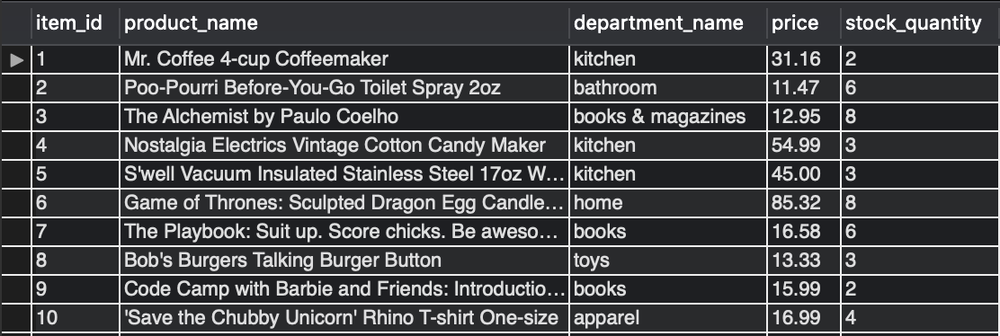

# BAMAZON

## Introduction

Bamazon is an e-commerce command-line application, run by NodeJS. The application displays the inventory list and price of products available on bamazon and processes customer orders. Bamazon's inventory database is available through a MySQL server.

## Technologies Used
* Javascript
* NodeJS
* MySQL database

## Instructions

1. To initialize the application, begin by entering the following statement into the command line:
*node bamazonCustomer.js*. 
Please note that this step assumed that you already have node set up on your device and are in the correct directory. Assuming you have entered the command correctly, the following text should be displayed. 

2. This is the list of products available for purchase on Bamazon. The application will prompt you for the product ID associated with the product you would like to purchase. After entering the product ID, the application will also inquire about the number of units you would like to purchase. This is shown in the image below: 

Based on the response that you provide, one of three outcomes will occur. 

### Invalid ID

This is the response that occurs if the product ID entered does not correspond with any of the items on the inventory list. The application informs you that you entered the wrong product ID and exits the application. At this point, you will need to restart the program as described in step 1.

### Insufficient Quantity

This is the response that occurs if bamazon's inventory does not accomodate the quantity of product you want to purchase. The application informs you that there is an insufficient quantity of products and exits the application. At this point, you will need to restart the program as described in step 1.

### Successful Purchase

This is the response that occurs when the application is successfully able to locate the product requested and has enough inventory . The application informs you that your purchase was successful and provides a receipt of the purchase. At this point, if you would like to make another purchase, you will need to restart the program as described in step 1.

## MySQL Database 
Bamazon's inventory is stored in a database made accessible through a MySQL server. 

When a purchase is made, the database is updated as shown below.

